# System Architecture & Graph Schema Documentation

**Version:** 3.0.0
**Date:** 2026-02-02
**Status:** Production

---

## Table of Contents

1. [System Overview](#system-overview)
2. [Graph Schemas](#graph-schemas)
   - [RulesGraph Schema](#rulesgraph-schema)
   - [DataTransferGraph Schema](#datatransfergraph-schema)
3. [Architecture Diagrams](#architecture-diagrams)
4. [Rule Evaluation Logic](#rule-evaluation-logic)
5. [Data Flow](#data-flow)
6. [API Architecture](#api-architecture)
7. [Health Data Detection](#health-data-detection)

---

## System Overview

### High-Level Architecture

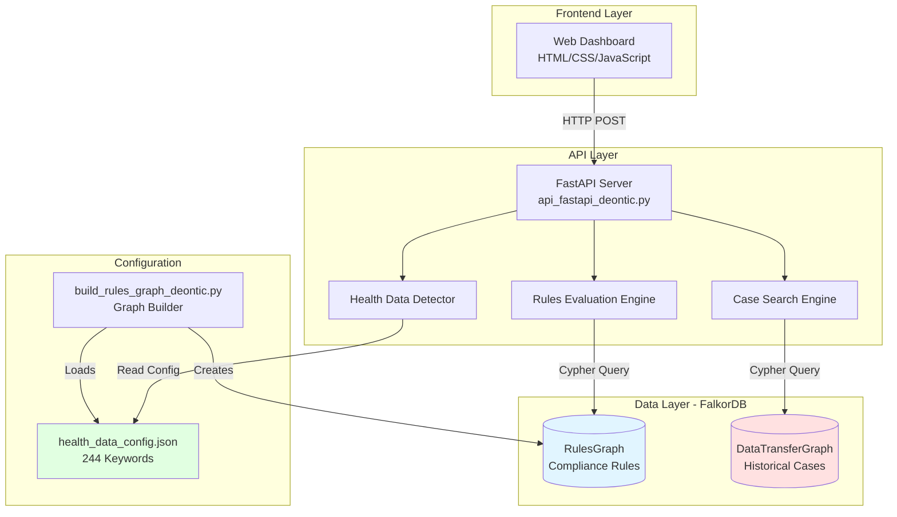

### Technology Stack

| Layer | Technology | Purpose |
|-------|------------|---------|
| **Frontend** | HTML, CSS, JavaScript, jQuery, Select2 | Interactive dashboard |
| **API** | FastAPI (Python), Pydantic | RESTful API, validation |
| **Graph Database** | FalkorDB (Redis module) | Graph storage & querying |
| **Query Language** | Cypher | Graph pattern matching |
| **Configuration** | JSON | Health detection config |

---

## Graph Schemas

### RulesGraph Schema

The **RulesGraph** implements a deontic logic framework for compliance rules using ODRL (Open Digital Rights Language) principles.

#### Node Types

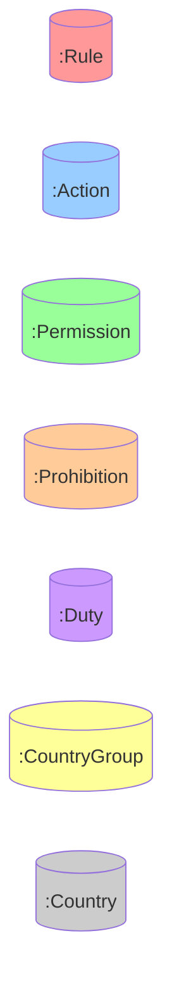

#### Complete RulesGraph Schema

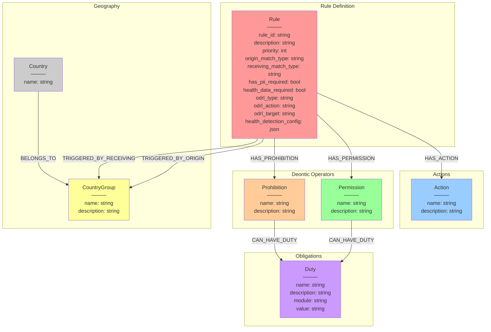

#### RulesGraph Node Details

##### 1. Rule Node
```cypher
(:Rule {
    rule_id: "RULE_1",                          // Unique identifier
    description: "EU/EEA internal transfer",     // Human-readable description
    priority: 1,                                 // Execution priority (1 = highest)
    origin_match_type: "ANY",                    // 'ANY', 'ALL', 'NOT_IN'
    receiving_match_type: "ANY",                 // 'ANY', 'ALL', 'NOT_IN'
    has_pii_required: false,                     // Triggers only if PII present
    health_data_required: false,                 // Triggers only if health data present
    odrl_type: "Permission",                     // ODRL: 'Permission' or 'Prohibition'
    odrl_action: "transfer",                     // ODRL: 'transfer', 'store', etc.
    odrl_target: "Data",                         // ODRL: 'Data', 'PII', 'HealthData'
    health_detection_config: "{...}"             // JSON config (RULE_11 only)
})
```

**Match Type Logic:**
- `ANY`: Rule triggers if country belongs to ANY of the specified groups
- `ALL`: Rule triggers for ALL countries (wildcard)
- `NOT_IN`: Rule triggers if country is NOT in specified groups

**Example:**
```cypher
// RULE_6: EU/EEA to Rest of World
origin_match_type: 'ANY'         // Origin must be in EU_EEA_ADEQUACY_UK
receiving_match_type: 'NOT_IN'   // Receiving must NOT be in EU_EEA_ADEQUACY_UK
```

##### 2. Action Node
```cypher
(:Action {
    name: "Transfer Data",
    description: "Transfer data between jurisdictions"
})
```

**All Actions:**
- Transfer Data
- Transfer PII
- Transfer Health Data
- Store in Cloud

##### 3. Permission Node
```cypher
(:Permission {
    name: "EU/EEA Internal Transfer",
    description: "Permission to transfer data within EU/EEA/UK/Crown/Switzerland"
})
```

**All Permissions (8 total):**
1. EU/EEA Internal Transfer
2. EU to Adequacy Countries Transfer
3. Crown Dependencies Transfer
4. UK to Adequacy Transfer
5. Switzerland Transfer
6. EU/EEA to Rest of World Transfer
7. BCR Countries Transfer
8. PII Transfer

##### 4. Prohibition Node
```cypher
(:Prohibition {
    name: "US PII to Restricted Countries",
    description: "Prohibition on transferring PII from US to China, Hong Kong, Macao, Cuba, Iran, North Korea, Russia, Venezuela"
})
```

**All Prohibitions (3 total):**
1. US PII to Restricted Countries
2. US Data to China Cloud
3. US Health Data Transfer

##### 5. Duty Node
```cypher
(:Duty {
    name: "Complete PIA Module (CM)",
    description: "Complete Privacy Impact Assessment with CM status",
    module: "pia_module",
    value: "CM"
})
```

**All Duties (5 total):**
1. Complete PIA Module (CM)
2. Complete TIA Module (CM)
3. Complete HRPR Module (CM)
4. Obtain US Legal Approval
5. Obtain US Legal Exception

##### 6. CountryGroup Node
```cypher
(:CountryGroup {
    name: "EU_EEA_FULL",
    description: "Country group: EU_EEA_FULL"
})
```

**All Country Groups (14 total):**
1. EU_EEA_FULL (27 countries)
2. UK_CROWN_DEPENDENCIES (4 countries)
3. SWITZERLAND (1 country)
4. ADEQUACY_COUNTRIES (14 countries)
5. SWITZERLAND_APPROVED (40 countries)
6. BCR_COUNTRIES (87 countries - computed)
7. CROWN_DEPENDENCIES_ONLY (3 countries)
8. UK_ONLY (1 country)
9. US (3 variants)
10. US_RESTRICTED_COUNTRIES (9 countries)
11. CHINA_CLOUD (4 countries)
12. EU_EEA_ADEQUACY_UK (computed)
13. EU_EEA_UK_CROWN_CH (computed)
14. ADEQUACY_PLUS_EU (computed)

##### 7. Country Node
```cypher
(:Country {
    name: "Ireland"
})
```

**Total Countries:** 87 unique countries

#### RulesGraph Relationships

| Relationship | From | To | Cardinality | Description |
|--------------|------|----|----|-------------|
| `HAS_ACTION` | Rule | Action | 1:1 | Rule applies to specific action |
| `HAS_PERMISSION` | Rule | Permission | 1:0..1 | Rule grants permission (XOR with prohibition) |
| `HAS_PROHIBITION` | Rule | Prohibition | 1:0..1 | Rule blocks action (XOR with permission) |
| `CAN_HAVE_DUTY` | Permission | Duty | 1:N | Permission requires duties |
| `CAN_HAVE_DUTY` | Prohibition | Duty | 1:N | Prohibition allows exception via duties |
| `TRIGGERED_BY_ORIGIN` | Rule | CountryGroup | 1:N | Rule applies to origin countries |
| `TRIGGERED_BY_RECEIVING` | Rule | CountryGroup | 1:N | Rule applies to receiving countries |
| `BELONGS_TO` | Country | CountryGroup | N:M | Country membership in groups |

#### Complete Rules List (11 Rules)

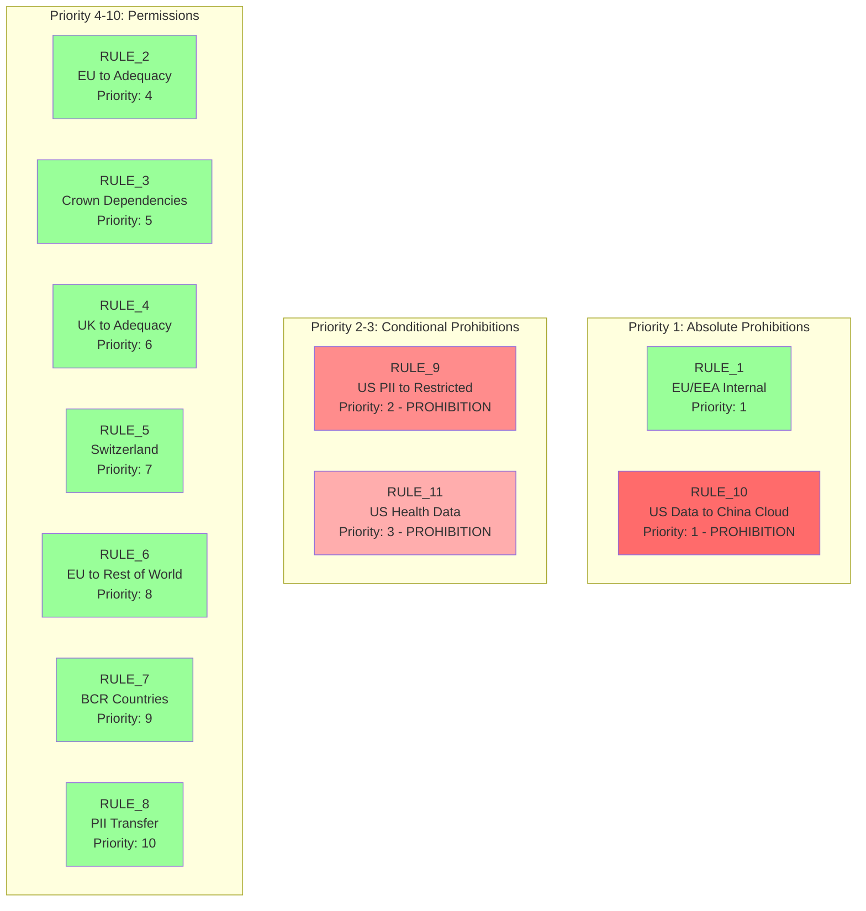

---

### DataTransferGraph Schema

The **DataTransferGraph** stores historical data transfer cases for case-based search and health data detection.

#### Complete DataTransferGraph Schema

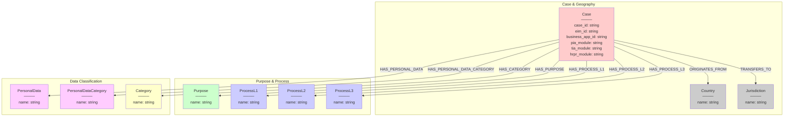

#### DataTransferGraph Node Details

##### 1. Case Node
```cypher
(:Case {
    case_id: "CASE_001",
    eim_id: "EIM-12345",
    business_app_id: "APP-789",
    pia_module: "CM",        // Privacy Impact Assessment status
    tia_module: "CM",        // Transfer Impact Assessment status
    hrpr_module: "OP"        // Human Rights Privacy Review status
})
```

##### 2. Country Node (Origin)
```cypher
(:Country {
    name: "Ireland"
})
```

##### 3. Jurisdiction Node (Receiving)
```cypher
(:Jurisdiction {
    name: "Poland"
})
```

##### 4. Purpose Node
```cypher
(:Purpose {
    name: "Marketing"
})
```

##### 5. Process Nodes (3 Levels)
```cypher
(:ProcessL1 {
    name: "Sales"
})

(:ProcessL2 {
    name: "Customer Management"
})

(:ProcessL3 {
    name: "CRM Operations"
})
```

##### 6. PersonalData Node
```cypher
(:PersonalData {
    name: "Email Address"
})
```

##### 7. PersonalDataCategory Node
```cypher
(:PersonalDataCategory {
    name: "Contact Information"
})
```

##### 8. Category Node
```cypher
(:Category {
    name: "Customer Data"
})
```

---

## Architecture Diagrams

### System Components

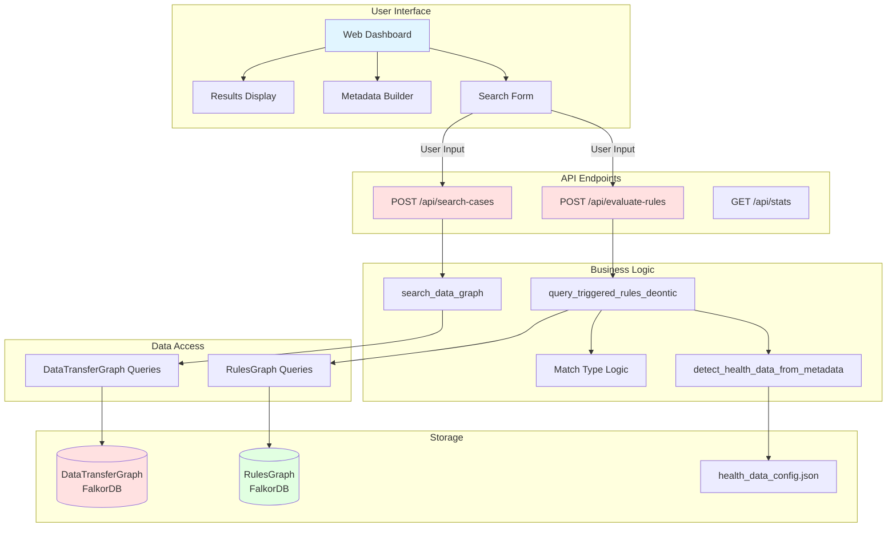

### Request Flow Diagram

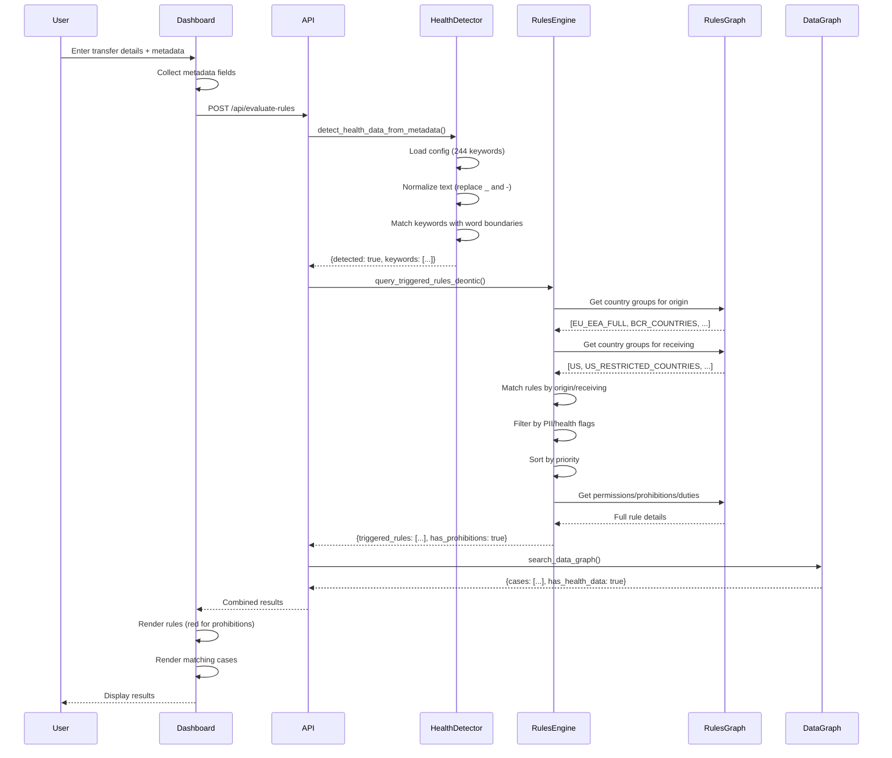

---

## Rule Evaluation Logic

### Match Type Algorithm

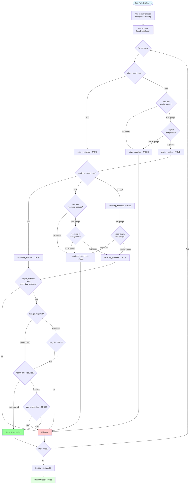

### Cypher Query Structure

```cypher
// Step 1: Get country groups for origin
MATCH (origin:Country {name: $origin_country})-[:BELONGS_TO]->(origin_group:CountryGroup)
WITH collect(DISTINCT origin_group.name) as origin_groups

// Step 2: Get country groups for receiving
MATCH (receiving:Country {name: $receiving_country})-[:BELONGS_TO]->(receiving_group:CountryGroup)
WITH origin_groups, collect(DISTINCT receiving_group.name) as receiving_groups

// Step 3: Match all rules
MATCH (r:Rule)

// Step 4: Get rule's origin groups
OPTIONAL MATCH (r)-[:TRIGGERED_BY_ORIGIN]->(r_origin:CountryGroup)
WITH r, origin_groups, receiving_groups, collect(DISTINCT r_origin.name) as rule_origin_groups

// Step 5: Get rule's receiving groups
OPTIONAL MATCH (r)-[:TRIGGERED_BY_RECEIVING]->(r_receiving:CountryGroup)
WITH r, origin_groups, receiving_groups, rule_origin_groups,
     collect(DISTINCT r_receiving.name) as rule_receiving_groups

// Step 6: Apply match logic
WITH r, origin_groups, receiving_groups, rule_origin_groups, rule_receiving_groups,
     CASE
         WHEN r.origin_match_type = 'ALL' THEN true
         WHEN r.origin_match_type = 'ANY' AND size(rule_origin_groups) = 0 THEN false
         WHEN r.origin_match_type = 'ANY' THEN any(g IN origin_groups WHERE g IN rule_origin_groups)
         ELSE false
     END as origin_matches,
     CASE
         WHEN r.receiving_match_type = 'ALL' THEN true
         WHEN r.receiving_match_type = 'ANY' AND size(rule_receiving_groups) = 0 THEN false
         WHEN r.receiving_match_type = 'ANY' THEN any(g IN receiving_groups WHERE g IN rule_receiving_groups)
         WHEN r.receiving_match_type = 'NOT_IN' AND size(rule_receiving_groups) = 0 THEN true
         WHEN r.receiving_match_type = 'NOT_IN' THEN NOT any(g IN receiving_groups WHERE g IN rule_receiving_groups)
         ELSE false
     END as receiving_matches

// Step 7: Filter by matches and data flags
WHERE origin_matches AND receiving_matches
      AND (NOT r.has_pii_required OR $has_pii = true)
      AND (NOT r.health_data_required OR $has_health_data = true)

// Step 8: Get related nodes
OPTIONAL MATCH (r)-[:HAS_ACTION]->(action:Action)
OPTIONAL MATCH (r)-[:HAS_PERMISSION]->(perm:Permission)
OPTIONAL MATCH (perm)-[:CAN_HAVE_DUTY]->(perm_duty:Duty)
OPTIONAL MATCH (r)-[:HAS_PROHIBITION]->(prohib:Prohibition)
OPTIONAL MATCH (prohib)-[:CAN_HAVE_DUTY]->(prohib_duty:Duty)

// Step 9: Return results sorted by priority
RETURN r.rule_id, r.description, r.priority,
       action.name, perm.name, prohib.name,
       collect(DISTINCT perm_duty), collect(DISTINCT prohib_duty)
ORDER BY r.priority
```

---

## Data Flow

### Complete Data Flow Architecture

```mermaid
graph TB
    subgraph "User Input"
        IN1[Origin Country: United States]
        IN2[Receiving Country: China]
        IN3[PII: true]
        IN4[Metadata: patient_id, diagnosis_codes]
    end

    subgraph "Health Detection Pipeline"
        HD1[Load health_data_config.json<br/>244 keywords + 27 patterns]
        HD2[Normalize text<br/>patient_id → patient id<br/>diagnosis_codes → diagnosis codes]
        HD3[Match keywords<br/>patient, diagnosis, icd]
        HD4[Return detected: true]
    end

    subgraph "Rule Matching Pipeline"
        RM1[Query origin groups<br/>US]
        RM2[Query receiving groups<br/>US_RESTRICTED_COUNTRIES, CHINA_CLOUD]
        RM3[Get all 11 rules]
        RM4[Apply match logic<br/>origin_matches & receiving_matches]
        RM5[Filter by PII flag<br/>has_pii_required]
        RM6[Filter by health flag<br/>health_data_required]
        RM7[Sort by priority<br/>1, 2, 3, 10]
    end

    subgraph "Results Assembly"
        RES1[RULE_10: US to China Cloud<br/>Priority 1 - PROHIBITION]
        RES2[RULE_9: US PII to Restricted<br/>Priority 2 - PROHIBITION]
        RES3[RULE_11: US Health Data<br/>Priority 3 - PROHIBITION]
        RES4[RULE_8: PII Transfer<br/>Priority 10 - PERMISSION]
    end

    subgraph "Response"
        OUT[JSON Response<br/>has_prohibitions: true<br/>total_rules_triggered: 4<br/>consolidated_duties: [...]]
    end

    IN1 --> RM1
    IN2 --> RM2
    IN3 --> RM5
    IN4 --> HD1

    HD1 --> HD2
    HD2 --> HD3
    HD3 --> HD4
    HD4 --> RM6

    RM1 --> RM4
    RM2 --> RM4
    RM3 --> RM4
    RM4 --> RM5
    RM5 --> RM6
    RM6 --> RM7

    RM7 --> RES1
    RM7 --> RES2
    RM7 --> RES3
    RM7 --> RES4

    RES1 --> OUT
    RES2 --> OUT
    RES3 --> OUT
    RES4 --> OUT

    style IN1 fill:#e1f5ff
    style IN2 fill:#e1f5ff
    style IN3 fill:#e1f5ff
    style IN4 fill:#e1f5ff
    style HD4 fill:#ffe1e1
    style RES1 fill:#ff6b6b
    style RES2 fill:#ff8c8c
    style RES3 fill:#ffadad
    style RES4 fill:#99ff99
    style OUT fill:#e1ffe1
```

### Rule Prioritization Example

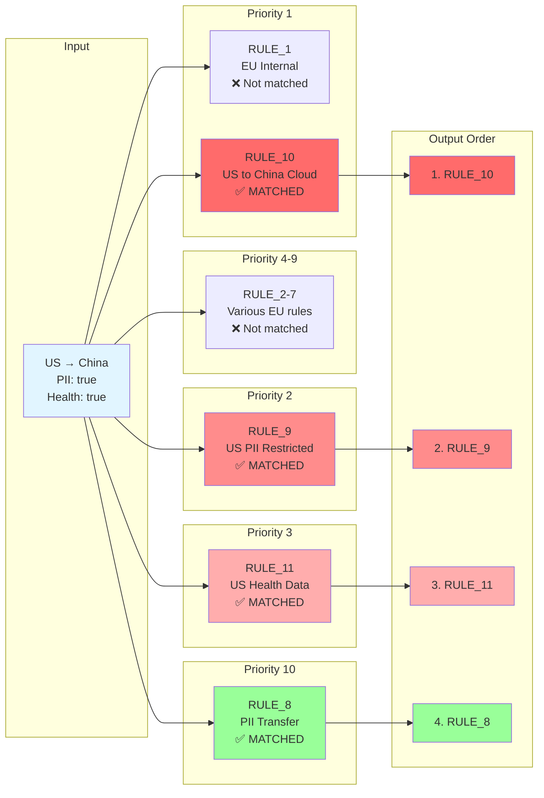

---

## API Architecture

### API Endpoint Structure

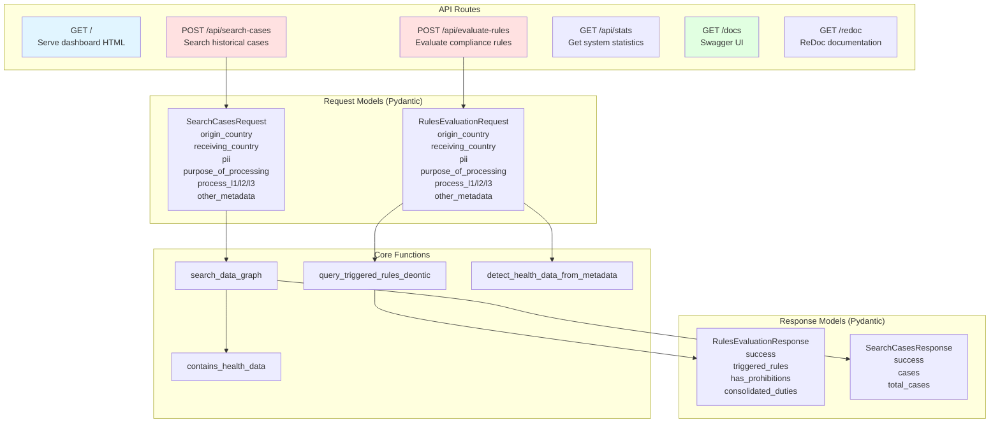

### Request/Response Flow

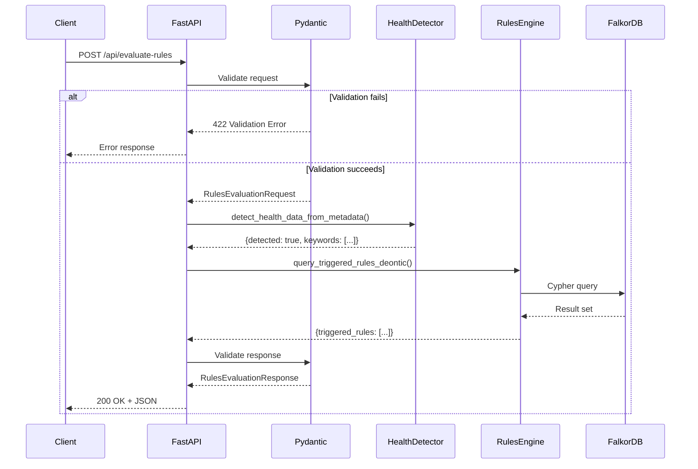

---

## Health Data Detection

### Health Detection Architecture

```mermaid
graph TB
    subgraph "Configuration"
        CONFIG[health_data_config.json<br/>────<br/>244 keywords<br/>27 patterns<br/>16 categories]
    end

    subgraph "Input Processing"
        INPUT[other_metadata<br/>────<br/>patient_id: identifier<br/>diagnosis_codes: ICD-10]
        NORMALIZE[Text Normalization<br/>────<br/>Replace _ with space<br/>Replace - with space<br/>Convert to lowercase]
        NORMALIZED[Normalized text<br/>────<br/>patient id identifier<br/>diagnosis codes icd 10]
    end

    subgraph "Matching Engine"
        KEYWORD[Keyword Matching<br/>────<br/>Word boundary regex<br/>\\bpatient\\b matches]
        PATTERN[Pattern Matching<br/>────<br/>icd-?\\d+ matches]
        RESULTS[Match Results<br/>────<br/>Keywords: patient, diagnosis, icd<br/>Patterns: icd-\\d+<br/>Fields: patient_id, diagnosis_codes]
    end

    subgraph "Output"
        OUTPUT[Detection Result<br/>────<br/>detected: true<br/>matched_keywords: [...]<br/>matched_patterns: [...]<br/>matched_fields: [...]]
    end

    CONFIG --> KEYWORD
    CONFIG --> PATTERN

    INPUT --> NORMALIZE
    NORMALIZE --> NORMALIZED

    NORMALIZED --> KEYWORD
    NORMALIZED --> PATTERN

    KEYWORD --> RESULTS
    PATTERN --> RESULTS

    RESULTS --> OUTPUT

    style CONFIG fill:#e1ffe1
    style INPUT fill:#e1f5ff
    style NORMALIZE fill:#ffffcc
    style OUTPUT fill:#ffe1e1
```

### Health Detection Algorithm

```mermaid
flowchart TD
    START([Start Detection])

    CHECK_META{other_metadata<br/>provided?}

    RETURN_FALSE[Return<br/>detected: false]

    LOAD_CONFIG[Load health_data_config.json<br/>244 keywords + 27 patterns]

    INIT_RESULTS[Initialize:<br/>matched_keywords = []<br/>matched_patterns = []<br/>matched_fields = []]

    LOOP_START{For each<br/>metadata field}

    GET_FIELD[Get key & value<br/>e.g., patient_id: identifier]

    NORMALIZE[Normalize text:<br/>patient_id → patient id<br/>Replace _ and - with space<br/>Convert to lowercase]

    FIELD_MATCHED[field_matched = false]

    CHECK_KEYWORDS{For each<br/>keyword}

    REGEX_MATCH{Regex match:<br/>\\b + keyword + \\b<br/>on normalized text?}

    ADD_KEYWORD[Add to matched_keywords<br/>Set field_matched = true]

    CHECK_PATTERNS{For each<br/>pattern}

    PATTERN_MATCH{Pattern match<br/>on original text?}

    ADD_PATTERN[Add to matched_patterns<br/>Set field_matched = true]

    CHECK_FIELD{field_matched?}

    ADD_FIELD[Add field to<br/>matched_fields]

    LOOP_END{More fields?}

    CHECK_DETECTED{matched_keywords<br/>OR<br/>matched_patterns?}

    RETURN_TRUE[Return<br/>detected: true<br/>with details]

    LOG_INFO[Log detection info<br/>to console]

    END([End Detection])

    START --> CHECK_META

    CHECK_META -->|No| RETURN_FALSE
    CHECK_META -->|Yes| LOAD_CONFIG

    LOAD_CONFIG --> INIT_RESULTS
    INIT_RESULTS --> LOOP_START

    LOOP_START --> GET_FIELD
    GET_FIELD --> NORMALIZE
    NORMALIZE --> FIELD_MATCHED
    FIELD_MATCHED --> CHECK_KEYWORDS

    CHECK_KEYWORDS --> REGEX_MATCH

    REGEX_MATCH -->|No| CHECK_KEYWORDS
    REGEX_MATCH -->|Yes| ADD_KEYWORD

    ADD_KEYWORD --> CHECK_KEYWORDS

    CHECK_KEYWORDS -->|Done| CHECK_PATTERNS

    CHECK_PATTERNS --> PATTERN_MATCH

    PATTERN_MATCH -->|No| CHECK_PATTERNS
    PATTERN_MATCH -->|Yes| ADD_PATTERN

    ADD_PATTERN --> CHECK_PATTERNS

    CHECK_PATTERNS -->|Done| CHECK_FIELD

    CHECK_FIELD -->|Yes| ADD_FIELD
    CHECK_FIELD -->|No| LOOP_END

    ADD_FIELD --> LOOP_END

    LOOP_END -->|Yes| LOOP_START
    LOOP_END -->|No| CHECK_DETECTED

    CHECK_DETECTED -->|No| RETURN_FALSE
    CHECK_DETECTED -->|Yes| RETURN_TRUE

    RETURN_TRUE --> LOG_INFO

    RETURN_FALSE --> END
    LOG_INFO --> END

    style START fill:#e1f5ff
    style END fill:#e1ffe1
    style RETURN_TRUE fill:#99ff99
    style RETURN_FALSE fill:#ffcccc
    style ADD_KEYWORD fill:#ffffcc
    style ADD_PATTERN fill:#ffffcc
    style ADD_FIELD fill:#ffffcc
```

### Example: patient_id Detection

```mermaid
graph LR
    subgraph "Input"
        I[patient_id: unique identifier]
    end

    subgraph "Step 1: Combine"
        S1[patient_id unique identifier]
    end

    subgraph "Step 2: Normalize"
        S2[patient id unique identifier]
    end

    subgraph "Step 3: Match Keywords"
        S3A[\\bpatient\\b<br/>✅ MATCHES]
        S3B[\\bidentifier\\b<br/>❌ No match]
        S3C[\\bunique\\b<br/>❌ No match]
    end

    subgraph "Step 4: Result"
        R[detected: true<br/>keywords: [patient]<br/>fields: [patient_id]]
    end

    I --> S1
    S1 --> S2
    S2 --> S3A
    S2 --> S3B
    S2 --> S3C
    S3A --> R

    style I fill:#e1f5ff
    style S2 fill:#ffffcc
    style S3A fill:#99ff99
    style S3B fill:#ffcccc
    style S3C fill:#ffcccc
    style R fill:#e1ffe1
```

---

## Database Statistics

### RulesGraph Statistics

| Entity | Count | Description |
|--------|-------|-------------|
| **Nodes** | | |
| Country Groups | 14 | Geographic groupings |
| Countries | 87 | Unique countries |
| Rules | 11 | Compliance rules |
| Actions | 4 | Transferable actions |
| Permissions | 8 | Allowed operations |
| Prohibitions | 3 | Blocked operations |
| Duties | 5 | Required obligations |
| **Relationships** | | |
| BELONGS_TO | 200+ | Country → CountryGroup |
| TRIGGERED_BY_ORIGIN | 30+ | Rule → CountryGroup |
| TRIGGERED_BY_RECEIVING | 30+ | Rule → CountryGroup |
| HAS_ACTION | 11 | Rule → Action |
| HAS_PERMISSION | 8 | Rule → Permission |
| HAS_PROHIBITION | 3 | Rule → Prohibition |
| CAN_HAVE_DUTY | 20+ | Permission/Prohibition → Duty |

### DataTransferGraph Statistics (Example)

| Entity | Count (Example) | Description |
|--------|-----------------|-------------|
| Cases | 1000+ | Historical transfers |
| Countries (Origin) | 50+ | Origin countries |
| Jurisdictions (Receiving) | 100+ | Receiving locations |
| Purposes | 20+ | Processing purposes |
| Process L1 | 10+ | Process areas |
| Process L2 | 50+ | Process functions |
| Process L3 | 100+ | Process details |
| PersonalData | 200+ | Data elements |
| PersonalDataCategory | 50+ | Data categories |

---

## Performance Considerations

### Query Optimization

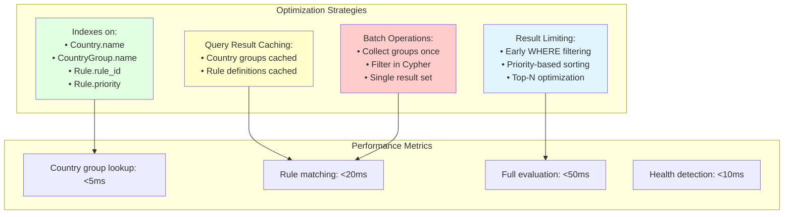

---

## Summary

This architecture implements a **deontic logic framework** for data transfer compliance using:

- **Graph Database (FalkorDB)** for flexible, relationship-based storage
- **ODRL-compliant schema** for policy representation
- **Priority-based rule evaluation** for deterministic results
- **Comprehensive health detection** with 244 keywords
- **RESTful API** with FastAPI and Pydantic validation
- **Interactive UI** with dynamic metadata builder

**Key Features:**
- ✅ 11 compliance rules covering EU, UK, US regulations
- ✅ Automatic health data detection from metadata
- ✅ Priority-based rule ordering (1 = highest)
- ✅ Deontic logic: Permissions, Prohibitions, Duties
- ✅ Country group-based matching with ANY/ALL/NOT_IN logic
- ✅ Comprehensive test suite (95.8% pass rate)

**Production Status:** ✅ Ready for deployment

---

**End of Architecture Documentation**
