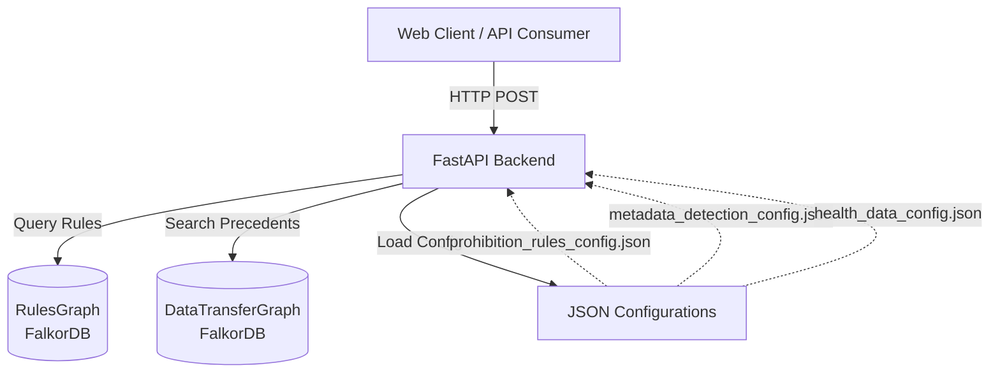
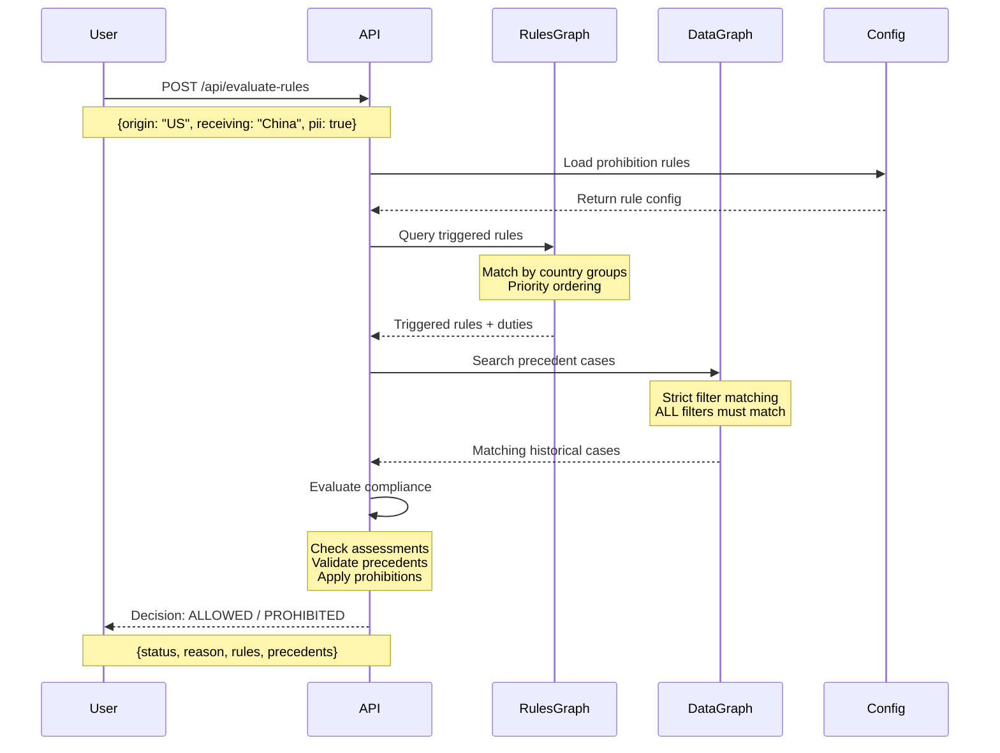
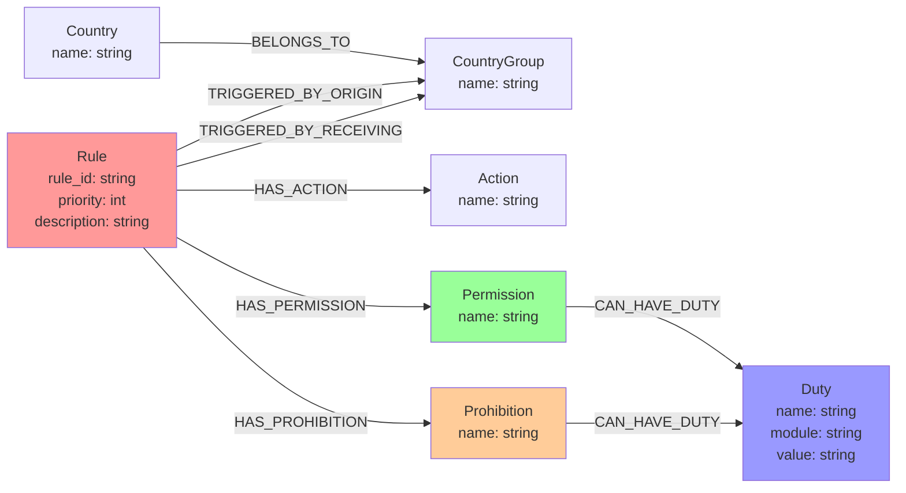
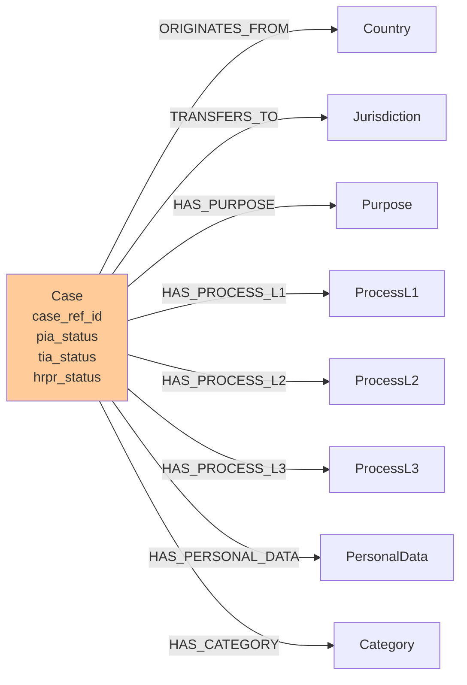
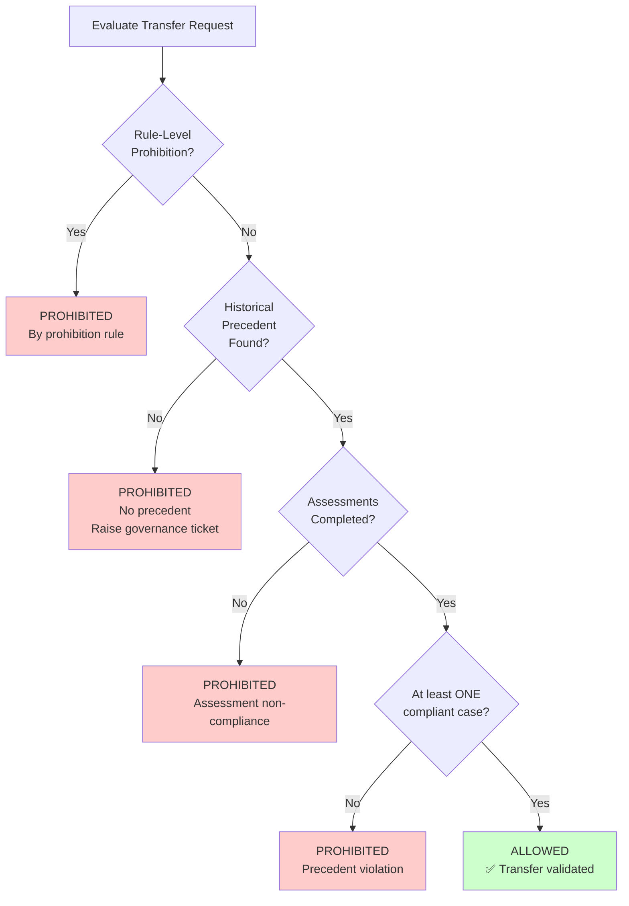

# Data Transfer Compliance System

A **graph-driven, self-serviceable, and scalable** compliance engine for evaluating cross-border data transfers using formal deontic logic (Permissions, Prohibitions, Duties) with FalkorDB.

[](https://www.python.org/downloads/)
[](https://www.falkordb.com/)
[](https://fastapi.tiangolo.com/)

---

## 🎯 Overview

This system evaluates data transfer compliance by:
- ✅ **Graph-based rules**: All logic stored in FalkorDB as nodes and relationships
- ✅ **Configuration-driven**: Add new rules via JSON without code changes
- ✅ **Precedent-based validation**: Checks historical cases for compliance patterns
- ✅ **Strict assessment compliance**: Only "Completed" status = compliant
- ✅ **Dynamic filtering**: Matches based on country, purpose, process, metadata
- ✅ **Self-serviceable**: Developers add rules independently

---

## 📐 Architecture

### System Components



### Data Flow



---

## 🏗️ Graph Structure

### RulesGraph Schema



### DataTransferGraph Schema



---

## 📋 Business Rules

### Permission Rules

| Rule ID | Description | Origin | Receiving | Required Assessments |
|---------|-------------|--------|-----------|----------------------|
| RULE_1 | EU/EEA/UK/Crown/CH Internal | EU/EEA/UK/Crown/CH | EU/EEA/UK/Crown/CH | PIA = Completed |
| RULE_2 | EU/EEA → Adequacy Countries | EU/EEA | Adequacy Countries | PIA = Completed |
| RULE_3 | Crown → Adequacy + EU/EEA | Crown Dependencies | Adequacy + EU/EEA | PIA = Completed |
| RULE_4 | UK → Adequacy + EU/EEA | United Kingdom | Adequacy + EU/EEA | PIA = Completed |
| RULE_5 | Switzerland → Approved | Switzerland | Approved Jurisdictions | PIA = Completed |
| RULE_6 | EU/EEA/Adequacy → Rest of World | EU/EEA/Adequacy | NOT in Adequacy/EU | PIA + TIA = Completed |
| RULE_7 | BCR Countries → Any | BCR Countries | Any Country | PIA + HRPR = Completed |
| RULE_8 | Any with PII | Any (with PII flag) | Any | PIA = Completed |

### Prohibition Rules (Configuration-Driven)

Loaded from `prohibition_rules_config.json`:

| Rule ID | Description | Origin | Receiving | Condition |
|---------|-------------|--------|-----------|-----------|
| RULE_9 | US PII → Restricted Countries | US | China, Russia, Iran, etc. | PII = true |
| RULE_10 | US → China Cloud Storage | US | China, Hong Kong, Macao | ANY data |
| RULE_11 | US Health Data | US | ANY | Health data detected |

**✨ Add new rules**: Edit `prohibition_rules_config.json` → Rebuild graph → Done!

---

## 🚀 Quick Start

### Prerequisites

```bash
# Install Python 3.11+
python --version

# Install FalkorDB (via Docker)
docker run -p 6379:6379 falkordb/falkordb:latest

# Install dependencies
pip install -r requirements_fastapi.txt
```

### Installation

```bash
# Clone repository
cd "deterministic policy"

# Install requirements
pip install fastapi uvicorn falkordb pydantic

# Build the rules graph
python build_rules_graph_deontic.py

# Load sample data (optional)
python create_sample_data.py

# Start the API
python api_fastapi_deontic.py
```

### Access

- **Swagger UI**: http://localhost:5001/docs
- **ReDoc**: http://localhost:5001/redoc
- **Dashboard**: http://localhost:5001/

---

## 📡 API Endpoints

### POST /api/evaluate-rules

Evaluate compliance rules for a data transfer.

**Request:**
```json
{
  "origin_country": "United Kingdom",
  "receiving_country": "India",
  "pii": true,
  "purpose_of_processing": ["Marketing", "Analytics"],
  "process_l1": "Sales",
  "pia_status": "Completed",
  "hrpr_status": "Completed"
}
```

**Response:**
```json
{
  "transfer_status": "ALLOWED",
  "transfer_blocked": false,
  "triggered_rules": [
    {
      "rule_id": "RULE_7",
      "description": "BCR Countries to any jurisdiction",
      "permission": {
        "name": "BCR Countries Transfer",
        "duties": [
          {"name": "Complete PIA Module", "value": "Completed"},
          {"name": "Complete HRPR Module", "value": "Completed"}
        ]
      }
    }
  ],
  "precedent_validation": {
    "status": "validated",
    "matching_cases": 2,
    "compliant_cases": 1,
    "message": "✅ ALLOWED: Found 2 matching case(s), 1 have all required assessments completed."
  },
  "assessment_compliance": {
    "compliant": true,
    "message": "✅ COMPLIANT: All 2 required assessments are Completed"
  }
}
```

### POST /api/search-cases

Search historical precedent cases.

**Request:**
```json
{
  "origin_country": "Germany",
  "receiving_country": "France",
  "purpose_of_processing": ["Marketing"]
}
```

### GET /api/countries

Get list of all countries.

### GET /api/purposes

Get list of all processing purposes.

### GET /api/processes

Get list of all process levels (L1, L2, L3).

---

## 🔧 Configuration

### Adding Prohibition Rules

Edit `prohibition_rules_config.json`:

```json
{
  "prohibition_rules": {
    "MY_NEW_RULE": {
      "enabled": true,
      "rule_id": "RULE_CUSTOM_1",
      "priority": 5,
      "origin_countries": ["Germany", "France"],
      "receiving_countries": ["Russia"],
      "bidirectional": false,
      "requires_pii": false,
      "prohibition_name": "EU to Russia Block",
      "duties": []
    }
  }
}
```

Then rebuild: `python build_rules_graph_deontic.py`

### Adding Metadata Detection

Edit `metadata_detection_config.json`:

```json
{
  "detection_categories": {
    "financial_data": {
      "enabled": true,
      "keywords": ["credit card", "bank account", ...],
      "patterns": ["\\d{4}[\\s-]?\\d{4}[\\s-]?\\d{4}[\\s-]?\\d{4}"]
    }
  }
}
```

Then restart: `python api_fastapi_deontic.py`

---

## 🧪 Decision Logic

### Priority Order



### Key Rules

1. **Rule-Level Prohibitions** (Highest Priority)
   - Absolute blocks from configuration
   - Example: US → China PII transfer

2. **No Precedent = PROHIBITED**
   - If filters provided and NO historical cases match → PROHIBITED
   - Message: "Raise governance ticket"

3. **Strict Assessment Compliance**
   - Only `"Completed"` status = compliant
   - `"In Progress"`, `"N/A"`, `null` → NON-COMPLIANT → PROHIBITED

4. **At Least One Compliant Case → ALLOWED**
   - If ≥1 historical case matches ALL filters AND has completed assessments → ALLOWED
   - Even if other cases are non-compliant

---

## 📊 Example Scenarios

### Scenario 1: Matching Precedent → ALLOWED

```bash
curl -X POST http://localhost:5001/api/evaluate-rules \
  -H "Content-Type: application/json" \
  -d '{
    "origin_country": "Germany",
    "receiving_country": "France",
    "purpose_of_processing": ["Marketing"],
    "pia_status": "Completed"
  }'
```

**Result**: ALLOWED (found matching case with PIA completed)

### Scenario 2: No Precedent → PROHIBITED

```bash
curl -X POST http://localhost:5001/api/evaluate-rules \
  -H "Content-Type: application/json" \
  -d '{
    "origin_country": "Germany",
    "receiving_country": "France",
    "purpose_of_processing": ["Office Support"],
    "pia_status": "Completed"
  }'
```

**Result**: PROHIBITED ("Office Support" purpose doesn't match any historical case → raise governance ticket)

### Scenario 3: Prohibition Rule → PROHIBITED

```bash
curl -X POST http://localhost:5001/api/evaluate-rules \
  -H "Content-Type: application/json" \
  -d '{
    "origin_country": "United States",
    "receiving_country": "China",
    "pii": true
  }'
```

**Result**: PROHIBITED (US → China PII blocked by RULE_9)

---

##  File Structure

```
deterministic policy/
├── api_fastapi_deontic.py          # FastAPI backend with deontic logic
├── build_rules_graph_deontic.py    # Graph builder (loads config)
├── create_sample_data.py           # Sample data generator
├── prohibition_rules_config.json   # Prohibition rules (editable!)
├── metadata_detection_config.json  # Metadata detection rules
├── health_data_config.json         # Health data keywords/patterns
├── sample_data.json                # Sample historical cases
├── templates/
│   └── dashboard.html              # Web UI dashboard
├── DEVELOPER_GUIDE.md              # Comprehensive developer guide
└── README.md                       # This file
```

---

## 🔒 Encoding Safety

All files use UTF-8 encoding:
- `# -*- coding: utf-8 -*-` in Python files
- `encoding='utf-8'` in all file operations
- `ensure_ascii=False` in JSON operations
- Supports Unicode country names (España, Türkiye, 中国, 日本, etc.)

---

## 📚 Documentation

- **README.md** (this file) - Architecture, rules, quick start
- **DEVELOPER_GUIDE.md** - Detailed guide for adding rules and configurations

---

## 🤝 Contributing

### Adding a New Prohibition Rule

1. Edit `prohibition_rules_config.json`
2. Run `python build_rules_graph_deontic.py`
3. Restart API
4. Test via Swagger UI

### Adding Metadata Detection

1. Edit `metadata_detection_config.json`
2. Restart API (no rebuild needed!)
3. Test via API

See `DEVELOPER_GUIDE.md` for detailed instructions.

---

## 📝 License

MIT License

---

## 🙏 Acknowledgments

Built with:
- [FalkorDB](https://www.falkordb.com/) - Graph database
- [FastAPI](https://fastapi.tiangolo.com/) - Modern Python web framework
- [Pydantic](https://pydantic-docs.helpmanual.io/) - Data validation
- [ODRL](https://www.w3.org/TR/odrl-model/) - Open Digital Rights Language specification

---

**Questions?** See `DEVELOPER_GUIDE.md` or check the Swagger UI at `http://localhost:5001/docs`
