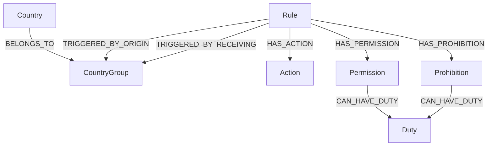
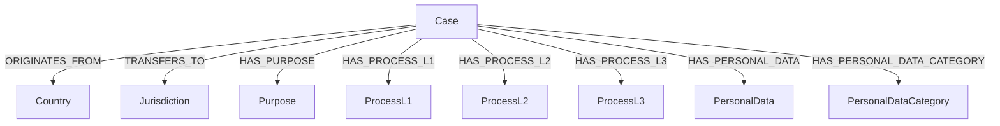

# Compliance Engine v6.0 - Developer Guide

## Table of Contents
1. [Architecture Overview](#architecture-overview)
2. [Rule System](#rule-system)
3. [Creating New Rules](#creating-new-rules)
4. [Multi-Agent Workflow](#multi-agent-workflow)
5. [Google A2A SDK Integration](#google-a2a-sdk-integration)
6. [Agent-to-FalkorDB Communication](#agent-to-falkordb-communication)
7. [Graph Schemas](#graph-schemas)
8. [Frontend Architecture](#frontend-architecture)
9. [API Reference](#api-reference)
10. [Testing](#testing)
11. [Configuration](#configuration)
12. [Troubleshooting](#troubleshooting)

---

## Architecture Overview

The Compliance Engine is built on a two-graph architecture using FalkorDB, with a React+TypeScript frontend and a LangGraph-based multi-agent backend. Agent-to-agent communication uses the Google A2A SDK (`a2a-sdk>=0.3.22`) for standardized `AgentExecutor`, `EventQueue`, and `AgentCard` abstractions, running in-process within a single FastAPI application.

### System Components

```
┌──────────────────────────────────────────────────────────────────────┐
│                     React + TypeScript Frontend                       │
│  ┌────────────┐   ┌──────────────┐   ┌────────────────────────────┐ │
│  │ Rules Graph│   │  Evaluator   │   │  10-Step Wizard + SSE      │ │
│  │ (ReactFlow)│   │              │   │  (Zustand + TanStack Query)│ │
│  └────────────┘   └──────────────┘   └────────────────────────────┘ │
├──────────────────────────────────────────────────────────────────────┤
│                     FastAPI Server (Routers)                          │
│  evaluation │ metadata │ wizard │ sandbox │ agent_events │ health    │
├──────────────────────────────────────────────────────────────────────┤
│  Services Layer            │  Multi-Agent Layer (LangGraph + A2A SDK)│
│  - RulesEvaluator          │  - Supervisor → Analyzer → Dictionary  │
│  - SandboxService          │  - → CypherGen → Validator → Complete  │
│  - CacheService            │  - Google A2A SDK AgentExecutors        │
│  - SSEManager              │  - Event-sourced audit trail            │
├──────────────────────────────────────────────────────────────────────┤
│                      FalkorDB (Graph Database)                        │
│  ┌──────────────────────┐    ┌─────────────────────────────────┐     │
│  │    RulesGraph        │    │     DataTransferGraph            │     │
│  │  (Rule definitions,  │    │  (Historical cases, assessments, │     │
│  │   country groups,    │    │   purposes, processes,           │     │
│  │   permissions/duties)│    │   personal data categories)      │     │
│  └──────────────────────┘    └─────────────────────────────────┘     │
└──────────────────────────────────────────────────────────────────────┘
```

### Key Directories

```
compliance_engine/
├── api/routers/         # 8 FastAPI router modules
├── agents/
│   ├── executors/       # A2A SDK AgentExecutor implementations (business logic)
│   ├── nodes/           # Thin LangGraph node shims (wrap executors via wrap_executor_as_node)
│   ├── prompts/         # 7 prompt files + builder
│   ├── workflows/       # LangGraph StateGraph (unchanged)
│   ├── protocol/        # A2A agent registry (AgentCard/AgentSkill via a2a-sdk)
│   ├── audit/           # Event store & event types
│   └── state/           # WizardAgentState TypedDict
├── services/            # Core business logic (evaluator, sandbox, SSE, cache, database)
├── rules/
│   ├── dictionaries/    # Country groups & rule definitions
│   └── templates/       # Cypher query templates
├── models/              # Pydantic models (schemas, wizard, AgentEvent for SSE)
├── frontend/            # Vite + React + TypeScript
│   └── src/             # pages, components, stores, hooks, services
├── cli/                 # Rule generator CLI tool
└── tests/               # Test suite
```

---

## Rule System

The engine uses a **three-set rule system** that is fully preserved from previous versions. Health rules, TIA/PIA/HRPR assessments, and real-time case searching all remain intact.

### SET 1: Case Matching Rules

Rules that check for historical precedent in the DataTransferGraph. If a case with completed assessments is found, transfer is **ALLOWED**.

```python
@dataclass
class CaseMatchingRule:
    rule_id: str
    name: str
    description: str
    priority: int  # 1-100, lower = higher priority
    origin_countries: Optional[FrozenSet[str]] = None
    origin_group: Optional[str] = None
    receiving_countries: Optional[FrozenSet[str]] = None
    receiving_group: Optional[str] = None
    receiving_not_in: Optional[FrozenSet[str]] = None
    required_assessments: RequiredAssessments = RequiredAssessments()
    requires_pii: bool = False
    requires_personal_data: bool = False
    enabled: bool = True
    odrl_type: str = "Permission"
    odrl_action: str = "transfer"
    odrl_target: str = "Data"
```

**Assessment compliance tracking** (TIA, PIA, HRPR) is handled in `services/rules_evaluator.py` lines 224-274. Each case match checks whether required assessments are completed.

### SET 2A: Transfer Rules

Country-to-country transfer permissions/prohibitions with highest priority.

```python
@dataclass
class TransferRule:
    rule_id: str
    name: str
    description: str
    priority: int
    transfer_pairs: List[Tuple[str, str]] = field(default_factory=list)
    origin_group: Optional[str] = None
    receiving_group: Optional[str] = None
    receiving_countries: Optional[FrozenSet[str]] = None
    bidirectional: bool = False
    outcome: RuleOutcome = RuleOutcome.PERMISSION
    requires_pii: bool = False
    required_actions: List[str] = field(default_factory=list)
    enabled: bool = True
    odrl_type: str = "Permission"
    odrl_action: str = "transfer"
    odrl_target: str = "Data"
```

### SET 2B: Attribute Rules

Rules based on data attributes (health, financial, biometric, etc.).

```python
@dataclass
class AttributeRule:
    rule_id: str
    name: str
    description: str
    priority: int
    attribute_name: str
    attribute_keywords: List[str] = field(default_factory=list)
    attribute_patterns: List[str] = field(default_factory=list)
    attribute_config_file: Optional[str] = None
    origin_countries: Optional[FrozenSet[str]] = None
    origin_group: Optional[str] = None
    receiving_countries: Optional[FrozenSet[str]] = None
    receiving_group: Optional[str] = None
    outcome: RuleOutcome = RuleOutcome.PROHIBITION
    requires_pii: bool = False
    enabled: bool = True
    odrl_type: str = "Prohibition"
    odrl_action: str = "transfer"
    odrl_target: str = "Data"
```

### Evaluation Flow (Preserved)

The evaluation engine (`services/rules_evaluator.py`) processes rules in this order:

1. **Phase 1 - Transfer Rules** (SET 2A): Check for direct prohibitions/permissions
2. **Phase 2 - Attribute Rules** (SET 2B): Check for attribute-based restrictions (health data, financial data, biometric data)
3. **Phase 3 - Case Matching** (SET 1): Search for historical precedent with assessment compliance

Health data detection uses `config/health_data_config.json` and `services/attribute_detector.py`.

### Precedent Evidence System

When evaluating transfers, the engine computes field-level match analysis:

| Field | Weight |
|-------|--------|
| origin_country | 25% |
| receiving_country | 25% |
| purposes | 15% |
| process_l1 | 10% |
| process_l2 | 8% |
| process_l3 | 7% |
| personal_data_names | 10% |

Evidence summaries include confidence levels (high/medium/low), strongest match scores, and assessment coverage.

---

## Creating New Rules

### Method 1: Manual Addition

Edit `rules/dictionaries/rules_definitions.py`:

```python
# Transfer Rule
TRANSFER_RULES["RULE_UK_CHINA_TECH"] = TransferRule(
    rule_id="RULE_UK_CHINA_TECH",
    name="UK to China Technology Transfer",
    description="Prohibit transfer of technology data from UK to China",
    priority=15,
    origin_countries=frozenset(["United Kingdom"]),
    receiving_countries=frozenset(["China"]),
    outcome=RuleOutcome.PROHIBITION,
    requires_pii=False,
    required_actions=["security_review", "management_approval"],
    odrl_type="Prohibition",
    odrl_action="transfer",
    odrl_target="TechnologyData",
    enabled=True,
)

# Attribute Rule
ATTRIBUTE_RULES["RULE_GENETIC_EU"] = AttributeRule(
    rule_id="RULE_GENETIC_EU",
    name="EU Genetic Data Protection",
    description="Genetic data from EU requires special handling",
    priority=5,
    attribute_name="genetic_data",
    attribute_keywords=["genetic", "dna", "genome", "hereditary"],
    origin_group="EU_EEA",
    outcome=RuleOutcome.PROHIBITION,
    odrl_type="Prohibition",
    odrl_target="GeneticData",
    enabled=True,
)
```

Then rebuild: `python main.py --build-graph`

### Method 2: 10-Step Wizard (Frontend)

Access the wizard at http://localhost:5001/wizard:

| Step | Action |
|------|--------|
| 1 | Select origin country & receiving countries |
| 2 | Choose scenario type (transfer/attribute) & data categories |
| 3 | Enter rule text in natural language |
| 4 | AI analyzes rule (Chain of Thought reasoning) |
| 5 | AI generates keyword dictionary |
| 6 | Review generated outputs (read-only) |
| 7 | Edit rule definition & terms dictionary (JSON editors) |
| 8 | Load rule into sandbox graph for testing |
| 9 | Test in sandbox with sample evaluations |
| 10 | Approve and promote rule to main RulesGraph |

### Method 3: CLI Tool

```bash
python -m cli.rule_generator_cli --interactive
python -m cli.rule_generator_cli --rule "Prohibit transfers from UK to China" --country "United Kingdom"
python -m cli.rule_generator_cli --rule "Health data cannot leave the EU" --type attribute
```

### Adding Country Groups

Edit `rules/dictionaries/country_groups.py`:

```python
MY_NEW_GROUP: FrozenSet[str] = frozenset({
    "Country1", "Country2", "Country3"
})

# Add to registry
COUNTRY_GROUPS["MY_NEW_GROUP"] = MY_NEW_GROUP
```

**Current groups include:**
- `EU_EEA` - EU 27 + Norway, Iceland, Liechtenstein
- `UK_CROWN_DEPENDENCIES` - UK, Jersey, Guernsey, Isle of Man
- `ADEQUACY_COUNTRIES` - Countries with EU adequacy decisions (incl. US via DPF)
- `BCR_COUNTRIES` - Binding Corporate Rules countries
- `US_RESTRICTED` - US-restricted countries (sanctions)
- `CHINA_TERRITORIES` - China, Hong Kong, Macao

---

## Multi-Agent Workflow

### LangGraph Architecture

```
Entry → Supervisor → {rule_analyzer | data_dictionary | cypher_generator |
                       validator | reference_data | human_review}
         ↑              ↓
         └── Supervisor ←── (retry on validation failure, max 3 iterations)
                            ↓
                    complete / fail → END
```

### Executor Architecture (A2A SDK Bridge)

Each agent is implemented as a Google A2A SDK `AgentExecutor` in `agents/executors/`, bridged to LangGraph via `wrap_executor_as_node()`:

```
LangGraph calls:  node_fn(state) -> state       [agents/nodes/*.py - thin shims]
                       |
                  wrap_executor_as_node()         [agents/executors/base_executor.py]
                       |
                  InProcessRequestContext(state)  [wraps WizardAgentState]
                  EventQueue()                    [A2A SDK async event queue]
                       |
                  executor.execute(ctx, queue)    [agents/executors/*_executor.py]
                       |
                  _drain_event_queue_to_sse()     [A2A events -> SSE AgentEvent]
                       |
                  return state                    [mutated by executor]
```

Node files in `agents/nodes/` are thin shims that import and wrap executors:

```python
# agents/nodes/cypher_generator.py (typical shim)
from agents.executors.cypher_generator_executor import CypherGeneratorExecutor
from agents.executors.base_executor import wrap_executor_as_node
from services.database import get_db_service

_executor = CypherGeneratorExecutor(db_service=get_db_service())
cypher_generator_node = wrap_executor_as_node(_executor)
```

### Agent Executors

| Agent | Executor | Technique | FalkorDB |
|-------|----------|-----------|----------|
| **Supervisor** | `SupervisorExecutor` | Dynamic prompt with state context | No |
| **Rule Analyzer** | `RuleAnalyzerExecutor` | Chain of Thought (CoT) | No |
| **Data Dictionary** | `DataDictionaryExecutor` | Category-specific prompts | No |
| **Cypher Generator** | `CypherGeneratorExecutor` | Mixture of Experts (MoE) | `EXPLAIN` syntax validation |
| **Validator** | `ValidatorExecutor` | Schema-aware checklist | Temp graph test queries |
| **Reference Data** | `ReferenceDataExecutor` | Gap analysis | Country group lookup |
| **Human Review** | _(inline in workflow)_ | `interrupt_before` | No |

### State Management

```python
class WizardAgentState(TypedDict):
    origin_country: str
    scenario_type: str
    receiving_countries: List[str]
    rule_text: str
    data_categories: List[str]
    messages: Annotated[list, add_messages]
    analysis_result: Optional[Dict]
    dictionary_result: Optional[Dict]
    rule_definition: Optional[Dict]
    cypher_queries: Optional[Dict]
    validation_result: Optional[Dict]
    current_phase: str
    iteration: int
    max_iterations: int
    requires_human_input: bool
    events: List[Dict]        # For SSE streaming
    success: bool
    error_message: Optional[str]
```

### Pydantic Validation Models

```python
class RuleDefinitionModel(BaseModel):
    rule_type: Literal["transfer", "attribute"]
    rule_id: str = Field(..., pattern=r"^RULE_.*$")
    name: str = Field(..., min_length=3, max_length=200)
    description: str = Field(..., min_length=10)
    priority: int = Field(..., ge=1, le=100)
    outcome: Literal["permission", "prohibition"]
    odrl_type: Literal["Permission", "Prohibition"]
    # Country groups validated against COUNTRY_GROUPS registry

class CypherQueriesModel(BaseModel):
    rule_check: str       # Must contain MATCH/CREATE/MERGE/RETURN
    rule_insert: str
    validation: str

class ValidationResultModel(BaseModel):
    overall_valid: bool
    confidence_score: float = Field(..., ge=0.0, le=1.0)
    errors: List[str]
    suggested_fixes: List[str]
```

### Event-Sourced Audit Trail

All agent actions are recorded in an append-only event store (`agents/audit/event_store.py`):

```python
class AuditEventType(str, Enum):
    WORKFLOW_STARTED = "workflow_started"
    WORKFLOW_COMPLETED = "workflow_completed"
    WORKFLOW_FAILED = "workflow_failed"
    AGENT_INVOKED = "agent_invoked"
    AGENT_COMPLETED = "agent_completed"
    AGENT_FAILED = "agent_failed"
    RULE_ANALYZED = "rule_analyzed"
    DICTIONARY_GENERATED = "dictionary_generated"
    CYPHER_GENERATED = "cypher_generated"
    VALIDATION_PASSED = "validation_passed"
    VALIDATION_FAILED = "validation_failed"
    REFERENCE_DATA_CREATED = "reference_data_created"
    HUMAN_REVIEW_REQUESTED = "human_review_requested"
    SANDBOX_CREATED = "sandbox_created"
    SANDBOX_EVALUATED = "sandbox_evaluated"
    RULE_PROMOTED = "rule_promoted"
```

---

## Google A2A SDK Integration

### Overview

The multi-agent system uses [Google's A2A Python SDK](https://github.com/google/a2a-python) (`a2a-sdk>=0.3.22`) as an in-process abstraction layer. Agents don't need separate HTTP servers -- they run within the single FastAPI process, with LangGraph remaining the workflow backbone.

### SDK Types Used

| SDK Type | Location | Usage |
|----------|----------|-------|
| `AgentExecutor` | `a2a.server.agent_execution` | Base class for all agent executors |
| `RequestContext` | `a2a.server.agent_execution` | Extended as `InProcessRequestContext` to wrap `WizardAgentState` |
| `EventQueue` | `a2a.server.events` | Async queue for A2A status events |
| `TaskState` | `a2a.types` | `working`, `completed`, `input_required`, `failed` |
| `TaskStatus` | `a2a.types` | Wraps `TaskState` for status update events |
| `TaskStatusUpdateEvent` | `a2a.types` | Emitted by executors, drained to SSE by the bridge |
| `AgentCard` | `a2a.types` | Agent capability descriptor in the registry |
| `AgentSkill` | `a2a.types` | Individual skill descriptor per agent |
| `AgentCapabilities` | `a2a.types` | Capability flags (streaming, push notifications) |

### Key Components

**`ComplianceAgentExecutor`** (`agents/executors/base_executor.py`):
- Extends `AgentExecutor` with `ai_service`, `event_store`, `db_service` injection
- Provides async convenience methods: `emit_working()`, `emit_completed()`, `emit_input_required()`
- Subclasses set `agent_name` and implement `async execute(context, event_queue)`

**`InProcessRequestContext`** (`agents/executors/base_executor.py`):
- Wraps `WizardAgentState` dict in the A2A `RequestContext` interface
- `context.state` gives direct access to the mutable LangGraph state
- `get_user_input()` returns `state["rule_text"]`
- Generates unique `task_id` and `context_id` for A2A event tracking

**`wrap_executor_as_node()`** (`agents/executors/base_executor.py`):
- Returns a sync `node_fn(state) -> state` function compatible with LangGraph
- Creates `InProcessRequestContext` and `EventQueue`, runs `executor.execute()` async
- Drains `EventQueue` and maps A2A events to SSE `AgentEvent` messages:
  - `TaskState.working` -> `AgentEventType.AGENT_STARTED`
  - `TaskState.completed` -> `AgentEventType.AGENT_COMPLETED`
  - `TaskState.input_required` -> `AgentEventType.HUMAN_REVIEW_REQUIRED`
  - `TaskState.failed` -> `AgentEventType.AGENT_FAILED`

**`A2AAgentRegistry`** (`agents/protocol/__init__.py`):
- Singleton registry storing `AgentCard` instances for all 6 agents
- Methods: `get_card()`, `list_cards()`, `find_agent_for_skill()`, `register_card()`
- Each card has `url="internal://agent_name"` (in-process, no HTTP)

### Adding a New Agent

1. Create `agents/executors/my_agent_executor.py`:
   ```python
   from agents.executors.base_executor import ComplianceAgentExecutor, InProcessRequestContext

   class MyAgentExecutor(ComplianceAgentExecutor):
       agent_name = "my_agent"

       async def execute(self, context, event_queue):
           ctx: InProcessRequestContext = context
           state = ctx.state
           await self.emit_working(event_queue, ctx)
           # ... your logic, mutate state ...
           await self.emit_completed(event_queue, ctx)
   ```

2. Create `agents/nodes/my_agent.py`:
   ```python
   from agents.executors.my_agent_executor import MyAgentExecutor
   from agents.executors.base_executor import wrap_executor_as_node

   _executor = MyAgentExecutor()
   my_agent_node = wrap_executor_as_node(_executor)
   ```

3. Register the agent card in `agents/protocol/__init__.py` by adding to `_build_default_cards()`.

4. Add the node to the workflow in `agents/workflows/rule_ingestion_workflow.py`.

---

## Agent-to-FalkorDB Communication

Three agents receive `DatabaseService` via constructor injection for direct FalkorDB interaction:

| Agent | FalkorDB Usage | Method |
|-------|---------------|--------|
| **Cypher Generator** | Syntax-validate generated Cypher with `EXPLAIN` | `db_service.execute_query("EXPLAIN ...")` |
| **Validator** | Run test queries in a temporary graph | `db_service.get_temp_graph()` -> insert -> validate -> `delete_temp_graph()` |
| **Reference Data** | Query existing country groups from RulesGraph | `db_service.execute_rules_query("MATCH (g:CountryGroup) RETURN g.name")` |

Injection happens in the node shims (e.g. `agents/nodes/cypher_generator.py`):

```python
_executor = CypherGeneratorExecutor(db_service=get_db_service())
```

Agents without FalkorDB needs (supervisor, rule_analyzer, data_dictionary) pass no `db_service` argument, defaulting to `None`.

---

## Graph Schemas

### RulesGraph Schema



**Node Properties:**
- `Rule`: rule_id, priority, origin_match_type, receiving_match_type, odrl_type, has_pii_required
- `Country`: name
- `CountryGroup`: name
- `Action`: name
- `Permission/Prohibition`: name
- `Duty`: name, module, value

### DataTransferGraph Schema



**Case Properties:**
- case_ref_id
- case_status
- pia_status (Completed/Pending/Not Started)
- tia_status (Completed/Pending/Not Started)
- hrpr_status (Completed/Pending/Not Started)

---

## Frontend Architecture

### Tech Stack
- **Vite** + **React 19** + **TypeScript**
- **@xyflow/react** (ReactFlow) for graph visualization
- **Zustand** for state management (wizard flow)
- **TanStack React Query** for API data caching
- **Tailwind CSS** for styling

### Three Pages

| Page | Route | Description |
|------|-------|-------------|
| Rules Network | `/` | Interactive graph visualization with country swimlanes and rule nodes |
| Evaluator | `/evaluator` | Rule evaluation form with dropdown data, results, and precedent cases |
| Wizard | `/wizard` | 10-step rule ingestion wizard with SSE progress panel |

### Key Frontend Files

```
frontend/src/
├── pages/
│   ├── HomePage.tsx              # Rules network graph
│   ├── EvaluatorPage.tsx         # Rule evaluator
│   └── WizardPage.tsx            # 10-step wizard
├── components/
│   ├── graph/
│   │   ├── RulesNetworkGraph.tsx  # ReactFlow graph (auto-syncs on data change)
│   │   ├── RuleNode.tsx           # Custom rule node component
│   │   └── CountrySwimlane.tsx    # Country group node component
│   ├── evaluator/
│   │   ├── EvaluatorForm.tsx      # Evaluation form with dropdowns
│   │   └── EvaluationResult.tsx   # Results display
│   └── wizard/
│       ├── WizardContainer.tsx    # Main wizard orchestrator
│       ├── WizardStepper.tsx      # Step indicator
│       ├── steps/                 # Step1Country through Step10Approval
│       └── shared/
│           └── AgentProgressPanel.tsx  # SSE event display
├── stores/
│   └── wizardStore.ts             # Zustand store for wizard state
├── services/
│   ├── api.ts                     # Axios instance
│   ├── wizardApi.ts               # Wizard API functions
│   └── evaluatorApi.ts            # Evaluator API functions
└── hooks/
    ├── useAgentEvents.ts          # SSE hook for agent progress
    └── useDropdownData.ts         # TanStack Query for dropdowns
```

### Wizard Data Flow

1. Steps 1-3: User input stored in Zustand → submitted to backend via `submitWizardStep`
2. Step 3 submission triggers AI agents on backend
3. After step 3, frontend fetches session state via `getWizardSession` to populate:
   - `analysisResult` (step 4)
   - `dictionaryResult` (step 5)
   - `editedRuleDefinition` (step 6-7)
4. Step 7 edits are sent to backend via `editRule`/`editTerms` API calls
5. Step 8 loads rule into sandbox graph
6. Step 9 tests in sandbox, results unwrapped from `{result, test_number}` response
7. Step 10 approves and promotes to main graph

---

## API Reference

### Evaluation

```http
POST /api/evaluate-rules
Content-Type: application/json

{
    "origin_country": "United Kingdom",
    "receiving_country": "India",
    "pii": true,
    "purposes": ["Marketing"],
    "metadata": {"data_type": "customer_records"}
}
```

### Wizard Lifecycle

```http
POST /api/wizard/start-session           # Start session
POST /api/wizard/submit-step             # Submit step data (triggers AI at step 3)
GET  /api/wizard/session/{id}            # Get full session state
PUT  /api/wizard/session/{id}/edit-rule  # Edit rule definition
PUT  /api/wizard/session/{id}/edit-terms # Edit terms dictionary
POST /api/wizard/session/{id}/load-sandbox      # Load to temp graph
POST /api/wizard/session/{id}/sandbox-evaluate  # Test in sandbox
POST /api/wizard/session/{id}/approve           # Promote to main graph
DELETE /api/wizard/session/{id}                  # Cancel & cleanup
```

### Agent Events (SSE)

```http
GET /api/agent-events/stream/{session_id}
Accept: text/event-stream
```

Events: `agent_started`, `agent_completed`, `agent_failed`, `phase_changed`, `analysis_progress`, `dictionary_progress`, `cypher_progress`, `validation_progress`, `workflow_complete`, `workflow_failed`

### Metadata

```http
GET /api/countries
GET /api/purposes
GET /api/processes
GET /api/all-dropdown-values
```

### Graph Data

```http
GET /api/graph/rules-network     # For ReactFlow visualization
GET /api/graph/country-groups    # Country group data
```

---

## Testing

### Running Tests

```bash
pytest tests/ -v
pytest tests/test_langgraph_workflow.py -v
pytest tests/ --cov=. --cov-report=html
```

### Test Files

| File | Coverage |
|------|----------|
| `test_langgraph_workflow.py` | Pydantic models, routing functions, workflow graph, run_rule_ingestion |
| `test_agentic_workflow.py` | Agent nodes (mocked), EventStore, API endpoints |
| `test_agent_audit.py` | AuditEventType, AuditEvent, EventStore thread safety |
| `test_rules_evaluation.py` | Country groups, rule structures, evaluator logic |
| `test_api.py` | Endpoint testing, request/response validation |
| `test_attribute_detection.py` | Health, financial, biometric data detection |

### Frontend Tests

```bash
cd frontend && npm test
```

---

## Configuration

### Environment Variables

```bash
# Database
FALKORDB_HOST=localhost
FALKORDB_PORT=6379

# AI Service
ENABLE_AI_RULE_GENERATION=true
AI_TOKEN_API_URL=https://your-token-api/translate
AI_LLM_API_URL=https://your-llm-api/v1/chat/completions
AI_LLM_MODEL=o3-mini
AI_TOKEN_USERNAME=your_username
AI_TOKEN_PASSWORD=your_password

# Auth Headers (Phase 2)
# Token_Type: SESSION_TOKEN
# X-HSBC-E2E-Trust-Token: <token>
# x-correlation-id: <username>
# x-usersession-id: <username>

# Server
APP_PORT=5001
ENVIRONMENT=development
```

---

## Troubleshooting

### Common Issues

1. **"AI service is not enabled"**
   - Set `ENABLE_AI_RULE_GENERATION=true`
   - Check AI credentials are valid

2. **"Rule validation failed"**
   - Ensure `rule_id` starts with `RULE_`
   - Priority must be 1-100
   - `odrl_type` must match outcome (`Prohibition` ↔ `prohibition`)

3. **Empty dropdowns in UI**
   - Ensure DataTransferGraph has data: `python main.py --upload-data sample_data.json`
   - Check database connection: `GET /health`

4. **Wizard stuck at step 4-5**
   - Check AI service credentials
   - View agent events SSE stream for errors
   - Check backend logs for AI request failures

5. **Sandbox evaluation returns errors**
   - Ensure sandbox was created (step 8) before testing (step 9)
   - Check FalkorDB connection and temp graph creation

---

## Contributing

1. Create a feature branch
2. Write tests for new functionality
3. Ensure all tests pass: `pytest tests/ -v`
4. Ensure frontend builds: `cd frontend && npm run build`
5. Submit a pull request

Follow existing code patterns and maintain Pydantic v2 compatibility.
