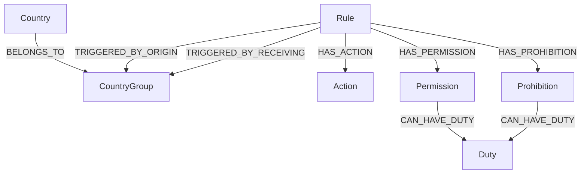
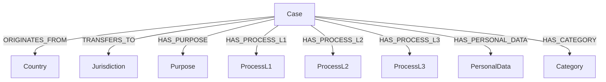

# Compliance Engine - Developer Guide

## Table of Contents
1. [Architecture Overview](#architecture-overview)
2. [Rule System](#rule-system)
3. [Creating New Rules](#creating-new-rules)
4. [AI-Powered Rule Generation](#ai-powered-rule-generation)
5. [Graph Schemas](#graph-schemas)
6. [API Reference](#api-reference)
7. [Testing](#testing)

---

## Architecture Overview

The Compliance Engine is built on a two-graph architecture using FalkorDB:

### System Components

```
┌─────────────────────────────────────────────────────────────────┐
│                        FastAPI Server                           │
├─────────────────────────────────────────────────────────────────┤
│  API Layer    │  Services Layer    │  Agents Layer              │
│  - Endpoints  │  - RulesEvaluator  │  - AI Service              │
│  - Validation │  - CacheService    │  - RuleGenerator           │
│  - Responses  │  - DatabaseService │  - LangGraph Workflow      │
├─────────────────────────────────────────────────────────────────┤
│                      FalkorDB (Graph Database)                  │
│  ┌──────────────────────┐    ┌─────────────────────────────┐   │
│  │    RulesGraph        │    │     DataTransferGraph       │   │
│  │  (Rule definitions)  │    │  (Historical case data)     │   │
│  └──────────────────────┘    └─────────────────────────────┘   │
└─────────────────────────────────────────────────────────────────┘
```

### Key Directories

```
compliance_engine/
├── api/                 # FastAPI routes and endpoints
├── agents/              # AI agents and LangGraph workflow
├── services/            # Business logic services
├── rules/               # Rule definitions and templates
│   ├── dictionaries/    # Static rule definitions
│   ├── templates/       # Cypher query templates
│   └── generated/       # AI-generated rules
├── cli/                 # Command-line tools
├── config/              # Configuration management
├── utils/               # Utility functions
└── tests/               # Test suites
```

---

## Rule System

The Compliance Engine uses a **two-set rule system**:

### SET 1: Case Matching Rules
Rules that check for historical precedent in the DataTransferGraph.

```python
@dataclass(frozen=True)
class CaseMatchingRule:
    rule_id: str
    name: str
    description: str
    priority: int  # 1-100, lower = higher priority

    # Country matching
    origin_countries: Optional[FrozenSet[str]] = None
    origin_group: Optional[str] = None
    receiving_countries: Optional[FrozenSet[str]] = None
    receiving_group: Optional[str] = None

    # Assessment requirements (at least one must be completed)
    requires_completed_pia: bool = True
    requires_completed_tia: bool = True
    requires_completed_hrpr: bool = True

    # ODRL properties
    outcome: RuleOutcome = RuleOutcome.PERMISSION
    odrl_type: str = "Permission"
    enabled: bool = True
```

### SET 2A: Transfer Rules
Country-to-country transfer permissions/prohibitions.

```python
@dataclass(frozen=True)
class TransferRule:
    rule_id: str
    name: str
    description: str
    priority: int

    origin_countries: Optional[FrozenSet[str]] = None
    origin_group: Optional[str] = None
    receiving_countries: Optional[FrozenSet[str]] = None
    receiving_group: Optional[str] = None

    outcome: RuleOutcome = RuleOutcome.PROHIBITION
    requires_pii: bool = False
    required_actions: List[str] = field(default_factory=list)

    odrl_type: str = "Prohibition"
    odrl_action: str = "transfer"
    odrl_target: str = "Data"
    enabled: bool = True
```

### SET 2B: Attribute Rules
Rules based on data attributes (health, financial, biometric).

```python
@dataclass(frozen=True)
class AttributeRule:
    rule_id: str
    name: str
    description: str
    priority: int

    attribute_name: str  # e.g., "health_data", "financial_data"
    attribute_keywords: List[str]  # Keywords to detect

    origin_countries: Optional[FrozenSet[str]] = None
    origin_group: Optional[str] = None
    receiving_countries: Optional[FrozenSet[str]] = None
    receiving_group: Optional[str] = None

    outcome: RuleOutcome = RuleOutcome.PROHIBITION
    requires_pii: bool = True

    odrl_type: str = "Prohibition"
    enabled: bool = True
```

### Rule Priority Order
Rules are evaluated in priority order (lower number = higher priority):
1. **Transfer Rules** (priority 1-30) - Most specific country-to-country rules
2. **Attribute Rules** (priority 31-60) - Data type specific rules
3. **Case Matching Rules** (priority 61-100) - Historical precedent rules

---

## Creating New Rules

### Method 1: Manual Addition (Recommended for Production)

Add rules directly to `rules/dictionaries/rules_definitions.py`:

```python
# In TRANSFER_RULES dictionary:
"RULE_UK_CHINA_TECH": TransferRule(
    rule_id="RULE_UK_CHINA_TECH",
    name="UK to China Technology Transfer",
    description="Prohibit transfer of technology data from UK to China",
    priority=15,
    origin_countries=frozenset(["United Kingdom"]),
    receiving_countries=frozenset(["China"]),
    outcome=RuleOutcome.PROHIBITION,
    requires_pii=False,
    required_actions=["security_review", "management_approval"],
    odrl_type="Prohibition",
    odrl_action="transfer",
    odrl_target="TechnologyData",
    enabled=True,
),

# In ATTRIBUTE_RULES dictionary:
"RULE_BIOMETRIC_GLOBAL": AttributeRule(
    rule_id="RULE_BIOMETRIC_GLOBAL",
    name="Global Biometric Data Protection",
    description="Special handling required for biometric data transfers",
    priority=35,
    attribute_name="biometric_data",
    attribute_keywords=["fingerprint", "face recognition", "retina", "voice print"],
    origin_group="ANY",
    receiving_group="ANY",
    outcome=RuleOutcome.PROHIBITION,
    requires_pii=True,
    odrl_type="Prohibition",
    enabled=True,
),
```

After adding rules, rebuild the RulesGraph:
```bash
python main.py --build-graph
```

### Method 2: AI-Powered Generation (CLI Tool)

Use the interactive CLI tool for natural language rule generation:

```bash
# Interactive mode (recommended)
python -m cli.rule_generator_cli --interactive

# Single rule
python -m cli.rule_generator_cli --rule "Prohibit transfers of health data from EU to non-adequacy countries"

# With country context
python -m cli.rule_generator_cli --rule "Personal data from Germany cannot go to Russia" --country "Germany"
```

The CLI provides:
1. **AI Analysis** - Uses Chain of Thought reasoning to parse your rule
2. **Cypher Generation** - Uses Mixture of Experts to create graph queries
3. **Validation** - Validates the generated rule against schemas
4. **Developer Sign-off** - You review and approve before uploading

### Method 3: API-Based Generation

Use the API endpoint for programmatic rule generation:

```python
import requests

response = requests.post(
    "http://localhost:5001/api/ai/generate-rule",
    json={
        "rule_text": "Financial data from the US cannot be transferred to sanctioned countries",
        "rule_country": "United States",
        "rule_type_hint": "attribute"
    }
)

result = response.json()
if result["success"]:
    print(f"Generated rule: {result['rule_id']}")
    print(f"Definition: {result['generated_dictionary']}")
```

---

## AI-Powered Rule Generation

### LangGraph Workflow Architecture

```
┌─────────────────────────────────────────────────────────────────┐
│                    LangGraph Workflow                           │
├─────────────────────────────────────────────────────────────────┤
│                                                                 │
│   ┌──────────────┐    ┌──────────────┐    ┌──────────────┐     │
│   │    Rule      │───>│   Cypher     │───>│  Validator   │     │
│   │  Analyzer    │    │  Generator   │    │              │     │
│   │  (CoT)       │    │  (MoE)       │    │              │     │
│   └──────────────┘    └──────────────┘    └──────────────┘     │
│         │                    │                   │              │
│         │                    │                   │              │
│         └────────────────────┴───────────────────┘              │
│                              │                                  │
│                     ┌────────▼────────┐                        │
│                     │   Supervisor    │◄─────┐                 │
│                     │                 │      │                 │
│                     └────────┬────────┘      │                 │
│                              │               │                 │
│                     ┌────────▼────────┐      │                 │
│                     │  Valid?         │──No──┘                 │
│                     │  (max 3 iter)   │                        │
│                     └────────┬────────┘                        │
│                              │Yes                              │
│                     ┌────────▼────────┐                        │
│                     │   Complete      │                        │
│                     └─────────────────┘                        │
│                                                                 │
└─────────────────────────────────────────────────────────────────┘
```

### Agent Descriptions

1. **Rule Analyzer Agent** (Chain of Thought)
   - Parses natural language input
   - Identifies rule type (transfer vs attribute)
   - Extracts countries, groups, outcomes
   - Outputs structured rule definition

2. **Cypher Generator Agent** (Mixture of Experts)
   - Three expert strategies: Performance, Comprehensive, Validation
   - Generates optimized Cypher queries
   - Considers graph schema constraints

3. **Validator Agent**
   - Validates rule definition against Pydantic models
   - Checks Cypher syntax
   - Verifies logical consistency
   - Suggests fixes if invalid

4. **Supervisor Agent**
   - Coordinates workflow execution
   - Routes to appropriate next agent
   - Manages retry iterations (max 3)

### Pydantic Validation Models

```python
class RuleDefinitionModel(BaseModel):
    rule_type: Literal["transfer", "attribute"]
    rule_id: str = Field(..., pattern=r"^RULE_.*$")
    name: str = Field(..., min_length=3, max_length=200)
    description: str = Field(..., min_length=10)
    priority: int = Field(..., ge=1, le=100)
    outcome: Literal["permission", "prohibition"]
    odrl_type: Literal["Permission", "Prohibition"]
    # ... additional fields

class CypherQueriesModel(BaseModel):
    rule_check: str = Field(..., min_length=10)
    rule_insert: str = Field(..., min_length=10)
    validation: str = Field(..., min_length=10)

class ValidationResultModel(BaseModel):
    overall_valid: bool
    confidence_score: float = Field(..., ge=0.0, le=1.0)
    errors: List[str] = Field(default_factory=list)
    suggested_fixes: List[str] = Field(default_factory=list)
```

---

## Graph Schemas

### RulesGraph Schema



**Node Properties:**
- `Rule`: rule_id, priority, origin_match_type, receiving_match_type, odrl_type, has_pii_required
- `Country`: name
- `CountryGroup`: name
- `Action`: name
- `Permission/Prohibition`: name
- `Duty`: name, module, value

### DataTransferGraph Schema



**Case Properties:**
- case_ref_id
- case_status
- pia_status (Completed/Pending/Not Started)
- tia_status (Completed/Pending/Not Started)
- hrpr_status (Completed/Pending/Not Started)

---

## API Reference

### Evaluate Transfer

```http
POST /api/evaluate-rules
Content-Type: application/json

{
    "origin_country": "United Kingdom",
    "receiving_country": "India",
    "pii": true,
    "purposes": ["Marketing"],
    "metadata": {"data_type": "customer_records"}
}
```

**Response:**
```json
{
    "transfer_status": "ALLOWED",
    "message": "Transfer allowed with conditions",
    "triggered_rules": [...],
    "consolidated_duties": ["Complete TIA", "Complete PIA"],
    "odrl_representation": {...}
}
```

### Generate Rule (AI)

```http
POST /api/ai/generate-rule
Content-Type: application/json

{
    "rule_text": "Prohibit health data transfers to non-GDPR countries",
    "rule_country": "Germany",
    "rule_type_hint": "attribute"
}
```

### Search Cases

```http
POST /api/search-cases
Content-Type: application/json

{
    "origin_country": "Germany",
    "receiving_country": "India",
    "purposes": ["HR"],
    "limit": 10
}
```

---

## Testing

### Running Tests

```bash
# All tests
python -m pytest tests/ -v

# Specific test file
python -m pytest tests/test_langgraph_workflow.py -v

# With coverage
python -m pytest tests/ --cov=. --cov-report=html
```

### Test Categories

1. **Unit Tests** (`tests/test_rules_evaluation.py`)
   - Country group validation
   - Rule structure validation
   - Cypher template building

2. **API Tests** (`tests/test_api.py`)
   - Endpoint testing
   - Request/response validation

3. **Attribute Detection Tests** (`tests/test_attribute_detection.py`)
   - Health, financial, biometric data detection
   - Keyword matching

4. **LangGraph Tests** (`tests/test_langgraph_workflow.py`)
   - Pydantic model validation
   - Workflow graph construction
   - Agent mocking

### Adding New Tests

```python
# Example: Testing a new rule
def test_new_transfer_rule():
    from rules.dictionaries.rules_definitions import TRANSFER_RULES

    rule = TRANSFER_RULES.get("RULE_NEW_ID")
    assert rule is not None
    assert rule.priority >= 1 and rule.priority <= 100
    assert rule.odrl_type in ("Permission", "Prohibition")
```

---

## Configuration

### Environment Variables

Create a `.env` file or set environment variables:

```bash
# Database
FALKORDB_HOST=localhost
FALKORDB_PORT=6379

# AI Service
ENABLE_AI_RULE_GENERATION=true
AI_TOKEN_API_URL=https://your-token-api/generate
AI_LLM_API_URL=https://your-llm-api/v1/chat/completions
AI_TOKEN_USERNAME=your_username
AI_TOKEN_PASSWORD=your_password
AI_LLM_MODEL=gpt-4

# Server
APP_PORT=5001
ENVIRONMENT=development
```

### Settings File

Configuration is managed in `config/settings.py` using Pydantic v2:

```python
from pydantic_settings import BaseSettings

class Settings(BaseSettings):
    model_config = ConfigDict(env_file=".env")

    database: DatabaseSettings = DatabaseSettings()
    ai: AIServiceSettings = AIServiceSettings()
    api: APISettings = APISettings()
```

---

## Agentic Mode & Reference Data Creation

### Overview

The Compliance Engine supports an **agentic mode** where AI agents autonomously detect and create missing reference data (country groups, attribute configs, keyword dictionaries) required by new rules. This is optional, traceable, and requires approval.

### Enabling Agentic Mode

```bash
# Environment variables
ENABLE_AGENTIC_MODE=true
ENABLE_AUTO_REFERENCE_DATA=true
REQUIRE_APPROVAL_FOR_WRITES=true
AGENT_AUDIT_RETENTION_DAYS=90
```

### How It Works

When generating a rule with `agentic_mode=true`:

1. **Rule Analysis** - AI parses the natural language rule
2. **Reference Data Detection** - Agent checks if the rule needs:
   - Country groups that don't exist yet
   - Attribute config files that are missing
   - Keyword dictionaries that are insufficient (< 10 keywords)
3. **Autonomous Creation** - For each need, a specialized agent creates:
   - Country group definitions with countries and regulatory source
   - Attribute config JSON files with keywords, patterns, categories
   - Expanded keyword dictionaries with 30-50 terms
4. **Approval Queue** - All created items are marked `pending_approval`
5. **Audit Trail** - Every action is logged with correlation IDs

### API Usage

```python
# Generate rule with agentic mode
response = requests.post("/api/ai/generate-rule", json={
    "rule_text": "Genetic data from EU cannot go to non-GDPR countries",
    "rule_country": "Germany",
    "rule_type": "attribute",
    "agentic_mode": True,  # Enable agentic reference data creation
})

# Check what was created
result = response.json()
for ref in result["reference_data_created"]:
    print(f"Created {ref['data_type']}: {ref['name']}")
    print(f"  Approval: {ref['approval_status']}")

# View agent audit trail
print(f"Session: {result['agent_session']['correlation_id']}")
for action in result["agent_session"]["actions"]:
    print(f"  [{action['status']}] {action['agent_name']}: {action['output_summary']}")
```

### Agent Audit Trail API

```bash
# List recent sessions
GET /api/agent/sessions?limit=50&session_type=rule_generation

# Get session details
GET /api/agent/sessions/{session_id}

# View pending approvals
GET /api/agent/pending-approvals

# Approve/reject an action
POST /api/agent/approve
{
    "entry_id": "abc123",
    "action": "approve",
    "approved_by": "admin"
}

# Export session for compliance
GET /api/agent/sessions/{session_id}/export

# Audit statistics
GET /api/agent/stats
```

### Traceability

Every agentic session is tracked with:
- **Correlation ID** - Links all actions in a session (e.g., `COR-A1B2C3D4E5`)
- **Session ID** - Unique identifier for the generation session
- **Entry IDs** - Per-action identifiers for approval workflow
- **Timestamps** - When each action started/completed
- **Duration** - How long each action took (in ms)
- **Input/Output** - What went in and what came out of each agent

---

## Precedent Evidence System

### Match Scoring

When evaluating transfers, the engine computes field-level match analysis between the query and each historical precedent case:

- **origin_country** (weight: 25%) - Exact country match
- **receiving_country** (weight: 25%) - Exact country match
- **purposes** (weight: 15%) - Overlap between requested and case purposes
- **process_l1** (weight: 10%) - Process level 1 overlap
- **process_l2** (weight: 8%) - Process level 2 overlap
- **process_l3** (weight: 7%) - Process level 3 overlap
- **personal_data_names** (weight: 10%) - Personal data type overlap

### Evidence Summary

Each evaluation with precedent cases includes:
- **Confidence Level** - high (90%+ match, 2+ cases), medium (70%+ or 1+ case), low
- **Strongest Match** - The best-matching case with its score
- **Assessment Coverage** - Which assessments are completed across matching cases
- **Evidence Narrative** - Human-readable explanation of the evidence

### API Response Example

```json
{
    "transfer_status": "ALLOWED",
    "evidence_summary": {
        "total_cases_searched": 50,
        "compliant_cases_found": 3,
        "strongest_match_score": 0.92,
        "strongest_match_case_id": "REF-001",
        "confidence_level": "high",
        "assessment_coverage": {
            "PIA": "3/3 cases completed",
            "TIA": "2/3 cases completed"
        },
        "evidence_narrative": "Found 3 compliant precedent cases..."
    },
    "precedent_validation": {
        "matching_cases": [
            {
                "case_ref_id": "REF-001",
                "match_score": 0.92,
                "relevance_explanation": "Case REF-001 is a precedent for UK to India transfers with completed PIA and TIA assessments.",
                "field_matches": [
                    {"field_name": "purposes", "match_percentage": 100.0, "match_type": "exact"},
                    {"field_name": "process_l1", "match_percentage": 50.0, "match_type": "partial"}
                ]
            }
        ]
    }
}
```

---

## Troubleshooting

### Common Issues

1. **"Cannot use 'list' as a dict key"**
   - Database result processing issue
   - Fixed in latest version - ensure `services/database.py` is updated

2. **"AI service is not enabled"**
   - Set `ENABLE_AI_RULE_GENERATION=true` in environment
   - Check AI credentials are valid

3. **"Rule validation failed"**
   - Check rule_id starts with "RULE_"
   - Ensure priority is 1-100
   - Verify odrl_type matches outcome

4. **Empty dropdowns in UI**
   - Ensure DataTransferGraph has data
   - Run `python main.py --build-graph`
   - Check database connection

### Logging

Enable debug logging:

```python
import logging
logging.basicConfig(level=logging.DEBUG)
```

View logs in console or configure file logging in `config/settings.py`.

---

## Contributing

1. Fork the repository
2. Create a feature branch
3. Write tests for new functionality
4. Ensure all tests pass
5. Submit a pull request

Follow the existing code patterns and maintain Pydantic v2 compatibility.
